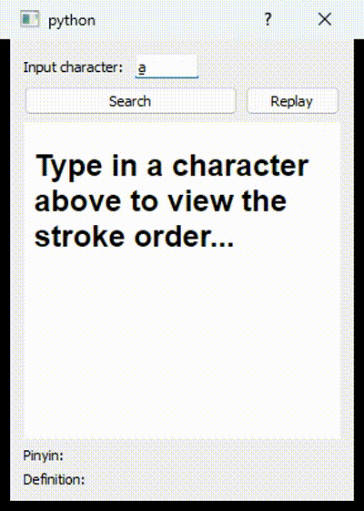

# chinese-char-dict
A simple python app to look up chinese characters and view their stroke orders!

### before running: 

1. install [PostgreSQL](https://www.postgresql.org/download/)
    - create a database named 'dictionary'
    - note: you have to update the database username and password in `tool\initalize.py:95` and `tool\dbtool.py:14` to match your system settings
2. install [Python 3](https://www.python.org/downloads/)
2. run `pip install psycopg2 pyside2` inside your fav shell

### to start:

1. run `main.py`
